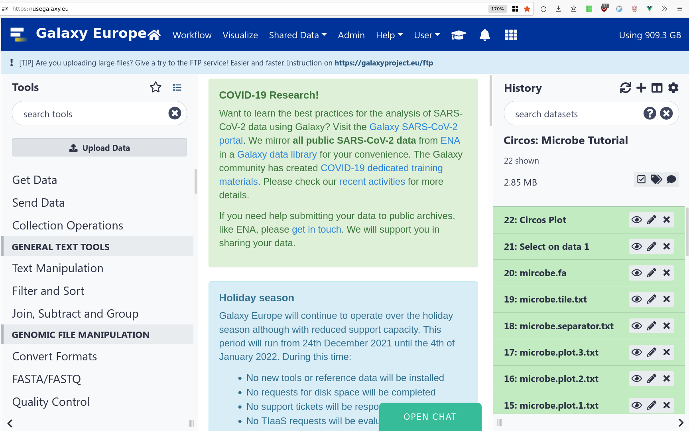
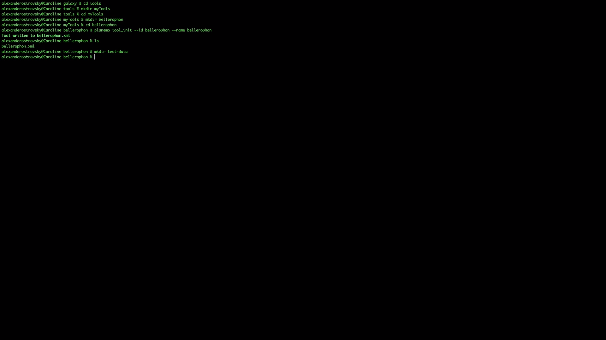
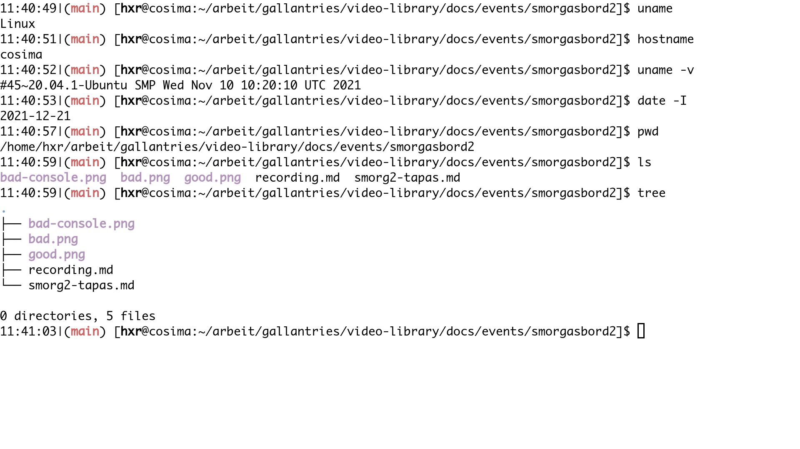
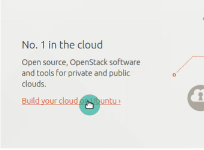

Below are some guidelines for recording the video:

## General

**The video should cover how to do the tutorial(s)**

- Cover what you do in Galaxy step-by-step
- Discuss the results in depth, avoid just saying "click here, click here, ok you're done"
- Oftentimes, instructors put Galaxy on one screen (recorded), and their materials on the other screen (not recorded) and just record how they interact with Galaxy to achieve the desired result(s). But if you have individual graphs or questions to discuss in your materials you might want to switch back and forth between the materials and Galaxy.

**It doesn't have to be perfect!!**

- Don't worry if things go wrong in Galaxy or you misspeak etc, this would happen during a live workshop too and is totally ok!
- Do not feel pressured to cut this out, a lot of us will be leaving those misspeaks in.

## Technical Guidelines

1. Start a [Zoom](https://zoom.us/) call with yourself, record that.
   - For Mac users, QuickTime Player is also a nice option.
   - Have another preference like OBS? Totally ok too!
   - We recommend zoom to folks new to video production as it is the easiest to get started and produces quite small file sizes.

2. Do a short **test recording** first
   - Is the **audio quality** good enough?
     - Wearing a headset often improves the audio quality.
   - **Screen sharing:** is your screen readable?
     - Make sure you **zoom in** enough for it to be clearly visible what you are doing in Galaxy
     - Imagine this is being viewed in a non-maximised YouTube window. Would it be legible?
     - If the participant is using 50% of their screen for the video, 50% for Galaxy, will it be legible?

3. **Record in smaller segments** if possible
   - E.g per section of the tutorial
   - Easier to update the training later
   - Can merge segments using software like [KDEnlive](https://kdenlive.org/en/)
     - We can also do this for you if needed

## Standards

1. Avoid mentioning this event in your video, so we can more easily re-use it later.
1. **Zoom in**, in every interface you're covering! Many people will be watching the video while they're doing the activity, and won't have significant monitor space. Which video below would you rather be trying to follow?

   Bad | Good 😍
   --- | ---
    | 

   Bad | Good 🤩
   --- | ---
    | 

2. (Especially for introductory videos!) Clearly call out what you're doing, especially on the first occurrence

   Bad | Good
   --- | ---
   "Re-run the job" | "We need to re-run the job which we can do by first clicking to expand the dataset, and then using the re-run job button which looks like a refresh icon."

   Bad | Good
   --- | ---
   "As you can see here the report says X" | "I'm going to view the output of this tool, click on the eyeball icon, and as you can see the report says X."

   But the same goes for terminal aliases, please disable all of your favourite terminal aliases and quick shortcuts that you're used to using, disable your bashrc, etc. These are all things students will try and type, and will fail in doing so. We need to be very clear and explicit because people will type exactly what is on the screen, and their environment should at minimum match yours.

   Bad | Good
   --- | ---
   `lg file`| `ls -al | grep file`
   `z galaxy`| `cd path/to/the/galaxy`

3. Consider using a pointer that is more visually highlighted.

   

   There are themes available for your mouse pointer that you can temporarily use while recording that can make it easier for watchers to see what you're doing.

   - [Windows](https://www.microsoft.com/en-us/p/mouse-pointer-highlight/9p7sb9s4rq7z?activetab=pivot:overviewtab)
   - [Linux](https://askubuntu.com/questions/777896/how-do-i-highlight-my-mouse-pointer-while-screen-recording/917587#917587)

## Content

1. **Start of video**
  - **Introduce yourself**
  - Give some **background** about the topic, many participants will be novices
2. The **style of teaching** is up to you, but guiding participants through each step of the tutorial is often well-received. Explain where you are clicking, what parameters and outputs mean, etc
3. **Speak slowly and clearly**
  - Take your time, we are not in a hurry, it's often a lot of new information
    for participants, give them a chance to process all of it
    are doing it.
4. **If things go wrong that is ok!**
  - It's educational and makes participants feel less bad if things go wrong
    for them
  - Just explain the steps you perform to figure out what went wrong
5. If your tutorial is long, **indicate good places for people to take
  a break** (e.g. when a tool takes a while to run)
6. **End of video**
  - Remind viewers about the **feedback form** embedded at end of the tutorial
  - If you have any **tips for where to learn more about the topic, or how to connect with the community** please share them at the end.
7. If you are doing both a lecture and a hands-on training, please create 2 separate videos (unless you prefer to jump back and forth between the two during your session)

## Video Editing

We can recommend using [KDEnlive](https://kdenlive.org/en/) for this (e.g. for trimming parts of the video, merging segments together).
