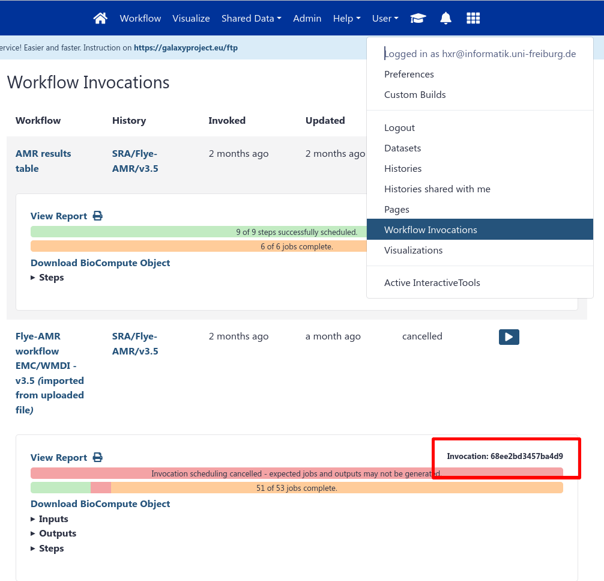

Our big new focus for this year, since we have such a huge library of fantastic content, will be to add workflows and test cases for these workflows. Workflows let us be sure that:

- The tools are installed
- They work on each specific server (and we can report problems when they exist!)
- They get the right result at the end (reproducible!)

This is the planned timeline for adding and updating workflows for GTN Tapas.

Date        | Time Left | What's happening
---         | ---       | ---
17 February | 4 weeks   | GTN CoFest! Here we will help you create workflows + workflow tests for your tutorials.
28 February | 2 weeks   | **Workflows Must be done**

## Workflow

1. [Find a video/material that's being taught](https://docs.google.com/document/d/1oobKOsr-P5kludyWxiuNYmHbPTuuMdXbJj4oZUdezss/edit#)
2. Check if it has a workflow (if it does, skip to step 5.)
3. Follow the tutorial
4. Build a workflow
5. Run that workflow in a new history to test
6. Obtain the workflow invocation ID, and your API key (User → Preferences → Manage API Key)

   

7. Install the latest version of `planemo`

   ```
   # In a virtualenv
   pip install planemo
   ```

8. Run the command to initialise a workflow test

   ```
   planemo workflow_test_init --from_invocation <INVOCATION ID> --galaxy_url <GALAXY SERVER URL> --galaxy_user_key" <GALAXY API KEY>
   ```

   This will produce a folder of files, for example from a testing workflow:

   ```
   $ tree
   .
   ├── test-data
   │   ├── input dataset(s).shapefile.shp
   │   └── shapefile.shp
   ├── testing-openlayer.ga
   └── testing-openlayer-tests.yml
   ```

9. Contribute those files to the GTN in a PR.
