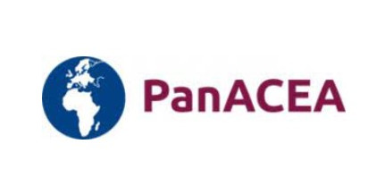
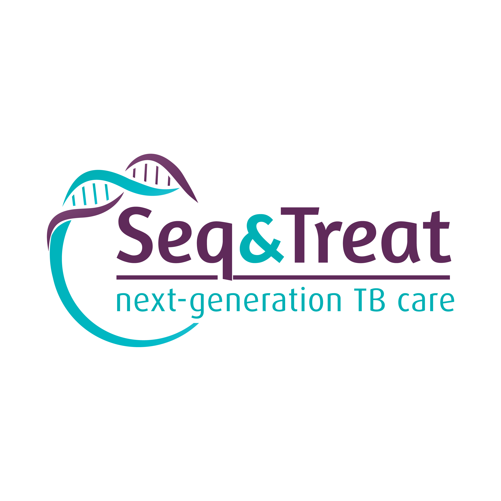

## Course Description

These series of webinars and tutorials aim at improving basic and applied knowledge associated with next-generation sequencing (NGS) technologies and their applications in the field of Tuberculosis (TB).

The trainings will introduce scalable and reproducible data analysis with Galaxy of *Mycobacterium tuberculosis* complex (MTBC) genomes.

A series of pre-recorded sessions and hands-on tutorials will show:
  - How to differentiate sequencing technologies and which ones are most commonly applied in TB and how **(Day 1)**
  - How NGS can be implement into TB laboratories **(Day 1)**
  - How to do mapping and variant calling **(Day 2)**
  - How to detect drug resistance conferring mutations, build phylogenetic trees and infer tuberculosis transmission **(Day 3)**
  - How to use different web tools dedicated to targeted analysis and what it takes to do bioinformatics **(Day 4)**.

After the trainings all participants are expected to:
  - Describe how NGS is being used in TB research and clinical pratice
  - Extract MTBC genomic variants from short sequencing reads
  - Identify drug resistant mutations
  - Identify genetic relationships and interpret a phylogenetic trees
  - Use web applications designed for M. tuberculosis

 

## Program

This workshop is virtual and asynchronous. Training sessions are pre-recorded and the material provided in advance in the program below. Whenever you're ready to get started, you can access the material by clicking in the respective days of the program. Everyday there are specific slots where you can meet the experts (check the schedule each day), ask questions and discuss ideas.

 

## LET'S GET STARTED!



 

### Day 1 - **WELCOME! And Practical Information**
*{{"2022-03-21" | date: "%-d %B %Y" }}*

Topic | Speaker | Time/Duration
--- | ---  | ---
Welcome and course information | All instructors | 10:30-11:00am CET
Get ready for the course | - | 5-10m

 

### Day 1  - **Overview of NGS technologies & TB specific NGS solutions**
*{{"2022-03-21" | date: "%-d %B %Y" }}*

Topic | Speaker  | Description | Duration
--- | --- | --- | ---
Overview of NGS technologies & TB specific NGS solutions | Andrea Cabibbe  | __Webinar:__ This webinar will introduce different sequencing technologies and what applies best to what kind of problem. | 1h10m
Implementation of NGS for TB- WHO documents and other  considerations  | Andrea Cabibbe | __Webinar:__ This webinar will summarize the recommendations and considerations available from the WHO documents on the use of NGS for TB| 1h
Live Discussion (**14:00 -16:00 CET**) | Andrea Cabibbe & Liliana Rutaihwa |__Q&A session:__  How do I choose the right sequencing technology for my samples? What is needed for NGS? Why is NGS better for drug resistance and outbreak analysis? | 2h

 

### Day 2 - **Mapping and variant calling**
*{{"2022-03-22" | date: "%-d %B %Y" }}*

Topic | Speaker  | Description | Duration
--- | --- | --- | ---
A very short introduction to Galaxy | Anton Nekrutenko | __Webinar:__ This video will introduce the Galaxy data analysis platform, and give a short demo on how to use it | 10m
Galaxy 101 | Anton Nekrutenko | __Hands-on:__ This tutorial will introduce you to Galaxy. You will familiarize yourself with tools, workflows and histories. Those skills will be needed the next days| 1h15m
Mapping and Variant calling  | Daniela Brites | __Video:__ llumina sequencing principles.  __Webinar:__ Main bioinformatics steps involved in mapping and variant calling from Illumina short reads applied to MTBC | 45m
Live discussion (**11:30-12:30 CET**) | Daniela Brites & Galo Goig | **Q&A session**| 1h
Mapping & Variant Calling | Peter van Heusden |  __Hands-on:__ Learn how to manipulate and process short reads obtained from MTBC isolates. Get familiar with quality control, mapping and NGS filetypes| 2h
Live discussion (**16:30-17:30 CET**) | Daniela Brites & Galo Goig  | **Q&A Live session**  | 1h
{:.table.table-striped}

 

### Day 3 - **Evolutionary epidemiology: using phylogenetics to understand DR emergence and Mtb transmission**
*{{"2022-03-23" | date: "%-d %B %Y" }}*

Topic | Speaker | Description | Duration
--- | --- | --- | ---
Drug resistance prediction  | Galo A. Goig | __Webinar:__ This video will introduce principles of drug resistance detection from genomic data | 20m
"Phylogenetic" mutations | Galo A. Goig | __Webinar:__ This video will introduce one particular type of mutations to take into account when studying drug resistance patterns | 15m
The concept of clustering | Galo A. Goig | __Webinar:__ Main aspects of clustering analysis to infer transmission in MTBC | 15m
Genetic distance thresholds | Galo A. Goig | __Webinar:__ Clustering as an approximation to infer transmission| 15m
Performing clustering analysis & drug resistance prediction | Galo A. Goig  | __Hands-on:__ Learning how to do clustering analysis and interpret drug resistance patterns | 2h
Live discussion (**11:30-12:30 CET**)| Galo A. Goig & Christop Stritt  |**Q&A Live session**| 1h
Introduction to phylogenetics | EMBL-EBI | Recommended **on-line introduction course from EMBL-EBI** | 1h
Inference of phylogenetic trees | Christoph Stritt |  __Hands-on:__ Main principles of phylogenetic inference, tree interpretation | 1h
Live discussion (**16:30-17:30 CET**) |  Christop Stritt & Galo A. Goig  |  **Q&A Live session**| 1h
{:.table.table-striped}

 

### Day 4 - **Webtools dedicated to MTBC bioinformatics & Be a bioinformatician in the jungle (optional)**
*{{"2022-03-24" | date: "%-d %B %Y" }}*

Topic | Speaker  | Description | Duration
--- | --- | --- | ---
Web tools for analysis of MTBC sequenced data | Arash Ghodousi | __Webinar:__ This video will introduce web tools designed for analysis of MTBC sequenced data |  50m
Introduction to the MTBseq pipeline  | Arash Ghodousi  | __Webinar:__ Introduction the MTBseq pipeline, an automated pipeline for mapping, variant calling and detection of resistance mediating and phylogenetic variants in MTBC | 30m
Live discussion  (**11:30-12:30 CET**)| Andrea Spitaleri| **Q&A Live session**| 1h
Introduction to linux | Andrea Spitaleri | __Webinar:__ Introduction to Linux OS: installation and usage | 30m
How to run programs (Python, Docker, Nextflow) |  Andrea Spitaleri  |  __Webinar:__ Learning how to install and use programs to analyze data| 30m
Demo video on how to use the shell commands | Andrea Spitaleri |__Webinar:__  Demo video on how to use the shell commands | 20m
The Unix Shell (optional) | Software carpentries  |  Recommended **hands-on** tutorial from software carpentries| 4h
Live discussion (**16:30-17:30 CET**)| Andrea Spitaleri & Arash Ghodousi |  **Q&A Live session**| 1h

{:.table.table-striped}

 

### Day 5 - Live Discussion (optional)
*{{"2022-03-25" | date: "%-d %B %Y" }}*

All instructors available live from **10:00h-12:30 am CET**

 

## Wrapping up

Please feel free to hang around in Slack and talk to us and the rest of the Galaxy community! Thanks for joining!!

- [Feedback Survey](https://forms.gle/6Xn8WudBvr3NMC3W7)
- [Certificate Request From](https://forms.gle/X2qgMQeobygH4orB8)

## After the Course
All these materials will remain online, so you can continue working on them for as long as you want. The only difference will be that you should ask your questions on the [GTN Gitter channel](https://gitter.im/Galaxy-Training-Network/Lobby), instead of Slack.

## Acknowledgements

This course was made possible thanks to the efforts of...

{: width="24%"}
{: width="24%"}
{: width="24%"}
{: width="24%"}
{: width="24%"}
{: width="24%"}
{: width="24%"}

*TB-CAPT and PanACEA are part of the EDCTP2 programme supported by the European Union.*
{: width="24%"}
{: width="24%"}
